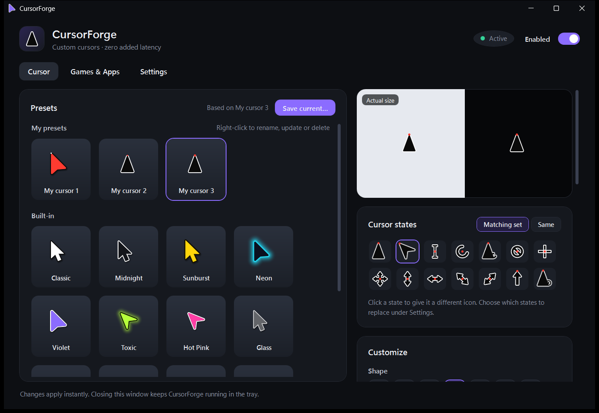
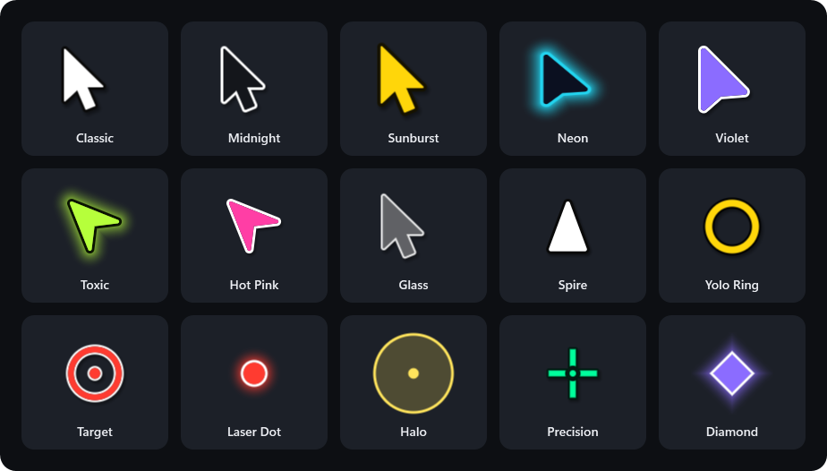
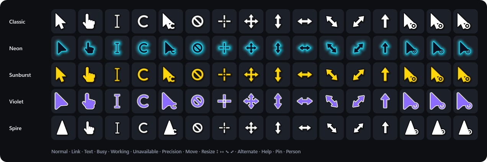

# CursorForge

A free, lightweight YoloMouse alternative for Windows: custom cursors with **zero added latency**.
It has a full matching set of state cursors and an anti-cheat-friendly overlay for games that draw their own cursor.



## Download

Get **`CursorForge.exe`** from the [latest release](../../releases/latest) and run it. It's a single self-contained file
for Windows 10/11 x64 (no .NET install needed). On first start it offers to install itself for your account
(no admin rights): `%LOCALAPPDATA%\Programs\CursorForge`, a Start-menu shortcut, autostart and an entry in
**Settings → Apps** to uninstall it again. Choose *No* to run it portable from its current folder instead.

The exe isn't code-signed, so Windows SmartScreen may warn on the first start: click **More info → Run anyway**.

## Presets

15 built-in looks to start from. Tweak shape, size, colours, outline, glow, shadow and opacity, or import your own
image, then save the result as your own preset.



Every Windows cursor state gets a matching icon in your style. Each state can also be switched to the main pointer
or any other shape.



## Build / install

Needs the .NET 10 SDK, plus Visual Studio with the **Desktop development with C++** workload (for the NativeAOT agent).

```powershell
.\build.ps1             # builds into .\dist
.\build.ps1 -Install    # also installs to %LOCALAPPDATA%\Programs\CursorForge + Start-menu shortcut
.\build.ps1 -Uninstall  # stops the agent, removes autostart/shortcut/files (keeps settings)
```

Run `CursorForge.exe`. It starts the agent, registers autostart and opens the settings window.

The preset and state images above are rendered by the real cursor renderer; regenerate them with
`dotnet run --project tools/IconGen -- --readme docs`.

## How it works

| Piece | What it is | Cost |
|---|---|---|
| `CursorForge.Agent.exe` | Native (NativeAOT) tray agent, starts with Windows | ~4 MB RAM, 0% CPU when idle |
| `CursorForge.exe` | WPF settings UI | Runs only while its window is open |

**System cursors (every app).** The agent renders your cursor into real multi-resolution `.cur`/`.ani` files
and points your cursor scheme (`HKCU\Control Panel\Cursors`) at them, the same way installed cursor themes work.
Windows loads the frame that matches its pointer size and shows it **1:1 on the GPU hardware cursor**. That means
pixel-sharp images and **latency identical to Windows' own cursor**. There are no input hooks, so mouse input is never touched.
(Runtime-created cursors via `SetSystemCursor` get stretched by the Windows pointer-size factor with bilinear filtering,
which is why CursorForge doesn't use them.) Because the scheme is written to the registry, your cursor is already there at logon.
Each state gets a matching glyph in your style: link hand, I-beam, animated busy spinner, working, unavailable,
precision, move, four resize arrows, alternate select, and help/pin/person.

Windows draws scheme cursors on a canvas the size of its pointer-size setting. When your cursor needs more room,
CursorForge raises that canvas **for the current session only** (`SPI_SETCURSORBASESIZE` without saving), up to 256 px,
the hardware-cursor limit. Your saved pointer size is untouched and comes back on exit. One side effect while raised:
Windows scales *other* apps' own cursors by the same factor, just as if you had enlarged the pointer size yourself.
Your original scheme is backed up to `%APPDATA%\CursorForge\windows-cursors-backup.txt` and restored when the agent exits,
is disabled, or on `CursorForge.Agent.exe --exit`.

**Inverted fill.** "Invert" makes the fill show the inverse of whatever is behind it. With a black/white (or no)
outline and hotspot dot it's written as a classic 1-bpp AND/XOR cursor, which the display hardware inverts
itself; coloured parts need a 32-bpp masked-colour cursor that many drivers only support in software. Either way,
over windows presented through hardware overlay planes (MPO; common for browsers and Electron apps) Windows can't
invert and shows white instead, exactly like Windows' own inverted pointer.

**Click flash (optional).** While a mouse button is held, the cursor switches to pre-rendered copies in your
left/right click colours. They're loaded from the same multi-resolution files with `LR_DEFAULTSIZE`, so they're just as sharp.
Button state is polled (`GetAsyncKeyState`) every 8 ms while the mouse is in use and every 100 ms when idle.
Raw Input or a hook would wake the agent for every movement report (up to 8000/s on gaming mice), while polling
costs the same tiny amount at any mouse rate. Nothing is hooked, so input latency is untouched. The flash only
happens while the pointer shows one of CursorForge's cursors, so games with their own cursor never pay for it.

**Game overlay (opt-in, per app).** Some games set their own cursor image, which the system swap can't touch.
For apps on the *Games & Apps* list, the agent shows your cursor in a click-through layered window.
It is visible only while the game shows a cursor, and hidden when the cursor is hidden or locked (e.g. aiming in a shooter).

- *Auto*: follow the OS cursor's visibility (recommended; safe for shooters).
- *Always*: also show over games that hide the OS cursor and draw a software cursor. It still hides while the cursor is clipped or pinned to the centre.

The overlay can't be truly zero-latency: DWM composes window positions once per refresh, while the hardware
cursor is latched at scan-out. CursorForge "late latches" the overlay: it samples the cursor just before DWM's
deadline instead of right after the previous frame. That keeps it about one refresh behind the hardware cursor (≈7 ms at 144 Hz)
instead of about two. A visible topmost window can also take a borderless game off its direct-flip path while shown.
For both reasons the overlay is per app and disappears whenever the game hides its cursor.

League of Legends uses its own hardware cursor, which nothing outside the game can replace without injection or
modified game files; under Vanguard, even paid YoloMouse falls back to an overlay there.

## Hotkeys (configurable)

- `Ctrl+Alt+Shift+C`: turn the custom cursor on/off
- `Ctrl+Alt+Shift+O`: add/remove the focused game from the overlay list (like YoloMouse's in-game hotkey)

## Files

- Settings: `%APPDATA%\CursorForge\config.json`
- Imported image: `%APPDATA%\CursorForge\custom.cfimg`
- Generated cursor files: `%APPDATA%\CursorForge\cursors\<hash>\*.cur|*.ani`
- Autostart: `HKCU\Software\Microsoft\Windows\CurrentVersion\Run\CursorForge`

Exiting the agent (tray → Exit, or *Stop agent* in Settings) restores your normal Windows cursors immediately.
